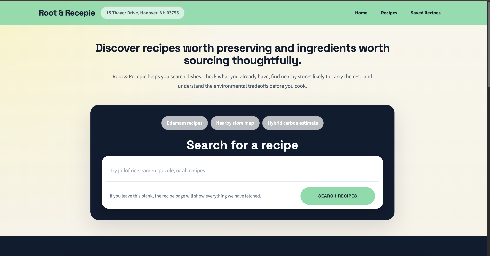
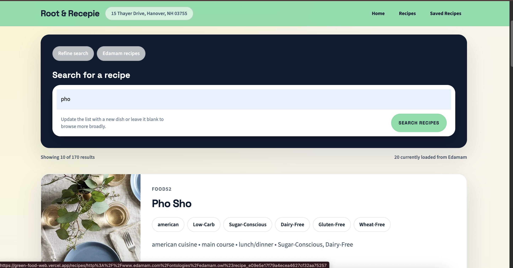
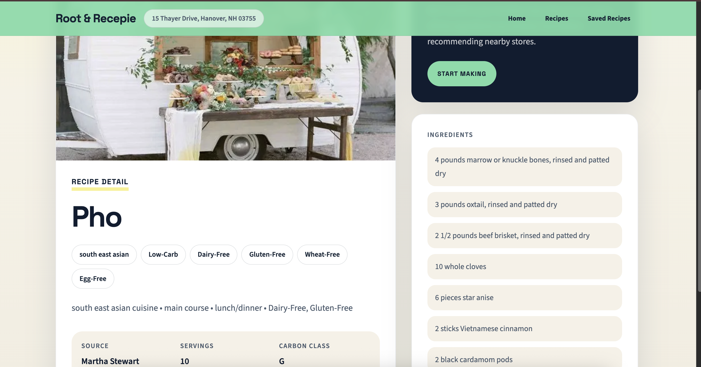
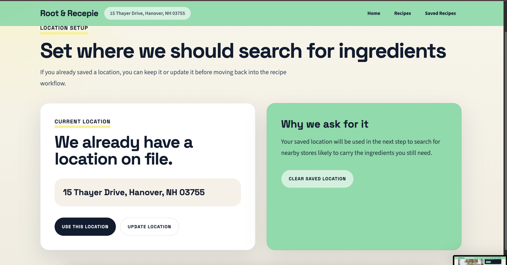
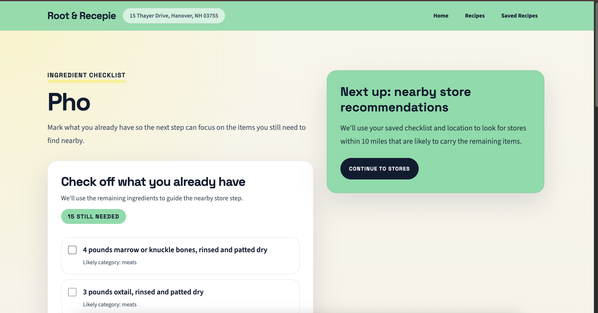
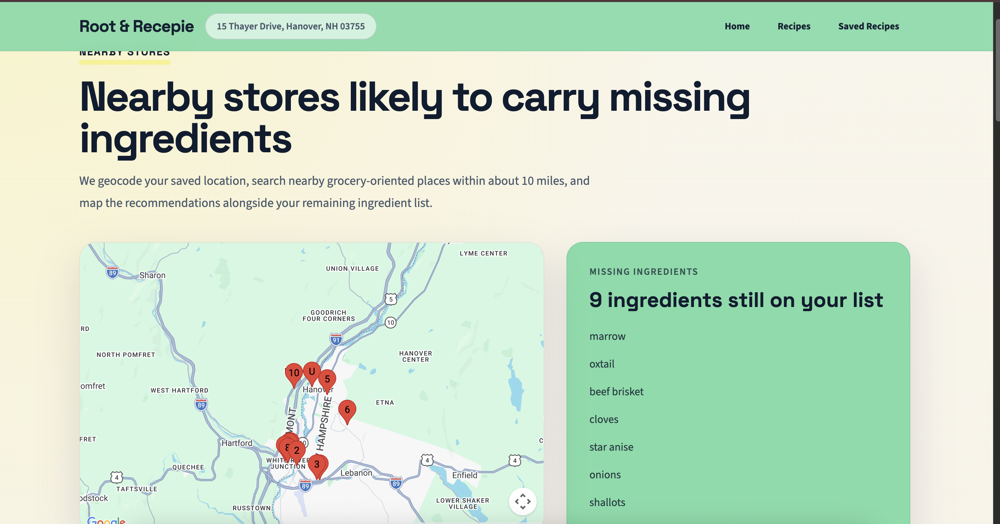
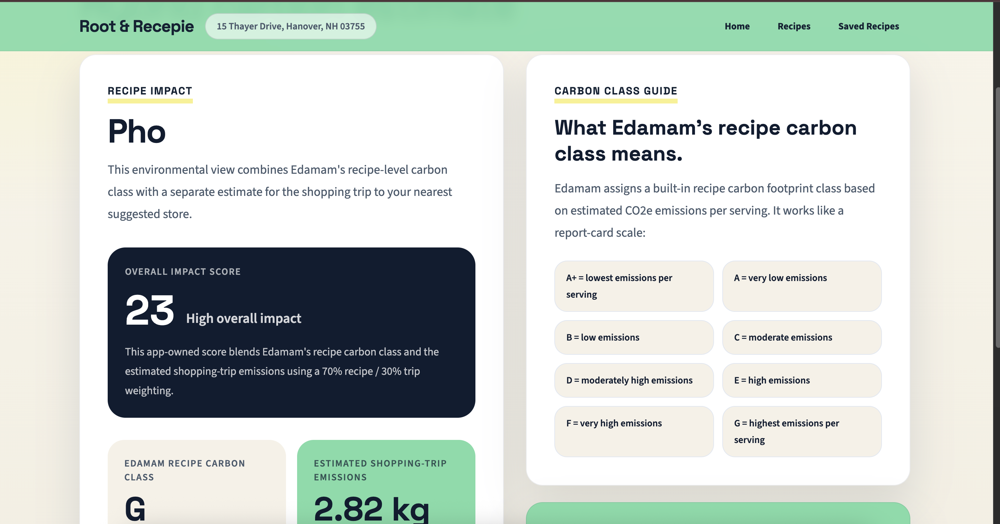
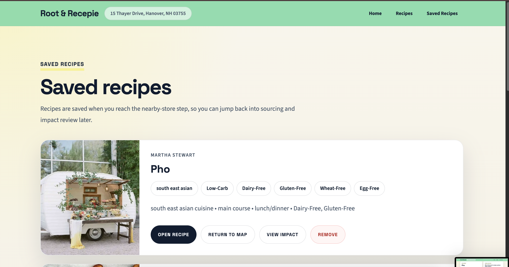

# Root & Recepie

Root & Recepie is a web app for cheefs who want to make good food and do good for the environment! The website lets users search for recipes, check off ingredients they already have, find nearby stores likely to carry what is missing, and review a hybrid environmental estimate before cooking.

## Live App

- Frontend: [https://green-food-web.vercel.app](https://green-food-web.vercel.app)
- Backend: [https://green-food-4q4w.onrender.com](https://green-food-4q4w.onrender.com)

## What It Does

1. Search recipes through the Edamam Recipe Search API.
2. Open a recipe and review cuisine, diet, health labels, ingredients, and source information.
3. Save a location locally in the browser.
4. Check off ingredients you already have.
5. Find nearby grocery-oriented stores using Google Maps geocoding and Places search.
6. Estimate the environmental impact using:
   - Edamam's recipe carbon class when available
   - Climatiq's trip emissions estimate for the shopping run
7. Blend those two signals into a custom Root & Recepie overall impact score.
8. Save recipes locally so users can jump back to the map and impact steps.

## Custom Impact Score

Root & Recepie does not just show third-party API outputs separately. It also creates its own app-level **overall impact score** that blends:

- **70% recipe impact** from Edamam's `co2EmissionsClass`
- **30% shopping-trip impact** from the Climatiq-based trip estimate

### How it works

1. Edamam's carbon class is mapped to a numeric score:
   - `A+ = 100`
   - `A = 92`
   - `B = 82`
   - `C = 70`
   - `D = 55`
   - `E = 40`
   - `F = 22`
   - `G = 8`
2. The shopping-trip emissions estimate in kilograms of CO2e is also converted into a 0-100 score.
3. Root & Recepie blends them with a `70/30` weighting.
4. The result is labeled as:
   - `Low overall impact`
   - `Lower overall impact`
   - `Moderate overall impact`
   - `Higher overall impact`
   - `High overall impact`

## Stack

Frontend: Next.js, React, Tailwind CSS

Backend: Express.js

APIs: Edamam Recipe Search API, Google Maps Geocoding API, Google Places API, Google Maps JavaScript API, Climatiq API

## Project Structure

```text
.
├── api/   # Express backend
├── web/   # Next.js frontend
└── README.md
```

## Setup Instructions

### 1. Install dependencies

```bash
npm install
```

### 2. Create a root `.env.local`

```env
NEXT_PUBLIC_API_BASE_URL=http://localhost:4000
EDAMAM_APP_ID=your_edamam_app_id
EDAMAM_APP_KEY=your_edamam_app_key
GOOGLE_MAPS_API_KEY=your_google_maps_server_key
NEXT_PUBLIC_GOOGLE_MAPS_API_KEY=your_google_maps_browser_key
CLIMATIQ_API_KEY=your_climatiq_api_key
```

### 3. Run the backend

```bash
npm run dev:api
```

### 4. Run the frontend

```bash
npm run dev:web
```

### 5. Open the app

Visit [http://localhost:3000](http://localhost:3000).

## Deployment Notes

### Vercel

- Framework preset: `Next.js`
- Root directory: `web`
- Required env vars:
  - `NEXT_PUBLIC_API_BASE_URL`
  - `NEXT_PUBLIC_GOOGLE_MAPS_API_KEY`

### Render

- Service type: `Web Service`
- Root directory: `api`
- Build command: `npm install`
- Start command: `npm start`
- Required env vars:
  - `EDAMAM_APP_ID`
  - `EDAMAM_APP_KEY`
  - `GOOGLE_MAPS_API_KEY`
  - `CLIMATIQ_API_KEY`
  - `CORS_ORIGIN`

Example production `CORS_ORIGIN`:

```env
CORS_ORIGIN=https://green-food-web.vercel.app
```

## Screenshots / Demo

### Demo Video

[Watch the demo on YouTube](https://youtu.be/VfJMw2h7dlI?si=UNtaVQ8-kL7YJlIG)

### Homepage



### Search Results



### Recipe Detail



### Set Location



### Ingredient Checklist



### Nearby Stores Map



### Environmental Impact Page



### Saved Recipes



## Learning Journey

### Inspiration

I recently watched a kdrama about cooking, where the main character (a famous chef) traveled back in time. She had various struggles, such as not being able to find ingredients quickly in Joseon Korea. I was inspired to create a product that would help chefs with finding places to buy ingredients, and to additionally better the environment, as a main plot point of the kdrama was that food is more than just fuel. It carries culture and identity, so I wanted to build something that shows that we can both save the environment and save memory and family identity through food.

### Potential impact

Root & Recipe helps chefs who wish to make environmentally friendly recipes with choosing recipes, ingredients, and places to buy these ingredients. Food is an important tool for transmitting heritage, strengthening social bonds, and defining identity across generations, but worries about being environmentally friendly might dissuade people from making certain foods, which we can help. Additionally, we promote climate awareness without making people navigate several different disconnected tools on their own.

### What new technology I learned and why I chose it

- Google Maps Places + Geocoding APIs
  I used these APIs to turn a user-inputted location into coords and nearby store recs, which added to the practicality and useability of the website.
- Climatiq API
  I used this to produce a trip emissions estimate to track part of the environmental impact of the user's chosen recepie.
- Next.js App Router
  Next.js helped me keep the frontend organized
## Technical Rationale

### Why I structured the backend and frontend this way

I split the website into two folders: web for the frontend and api for the backend. I did this because I structured my last website like this, and it cleanly seperates the two components for debugging and deployment

### Biggest technical tradeoffs and choices

- No Edamam caching
  After I hit the API rate limit for Edamam (the API I used for recipies), I considered implementing a cache to save on API calls, but Edamam's Terms of Service only allow caching under very specific scenarios that I was not in. Instead of sstoring recipe data in a database, I implemented memory reuse in session, which only works for a short time.
- Custom environmental score
  Instead of relying on Edamam and Climatiq environmental scores seperately, I created a blended score that makes it easier for users to compare different recepies on the app and gain a big-picture overview of the environmental impact. THe custom score is not an enviornmental truth, but a blended score of materials + travel emissions
- Nearby store quality 
  Improved using stricter place type filtering, tiered fallback, backend scoring, priority boosts, and exclusions for weak matches like convenience/vape/boba-style results.

### Most difficult technical bug and how I debugged it

I ran into a bug where the Edamam recepie ID's broke the frotnend router system, making recipe pages unable to load. The ID's, when not encoded properly, had slashes and "#"'s in them, which caused 404 erros. I debugged by comparing the failing URLS with the expected URLS, and then wrote a routing helper so that removes invalid characters.

## AI Usage

I did use AI tools (specifically, Codex). An example prompt I used was "diagnose the following problem: clicking the "use this location" button on the location setting page leads to a 404 error on a route where the URL contains an Edamam recipe URI

Codex's diagnosis suggested that the recepie URI encoding was causing the issue, but I still had to adapt this into a plan. My suggestion was to build a shared route helper so that Edamam URI's could be consistently encoded and decoded. 
